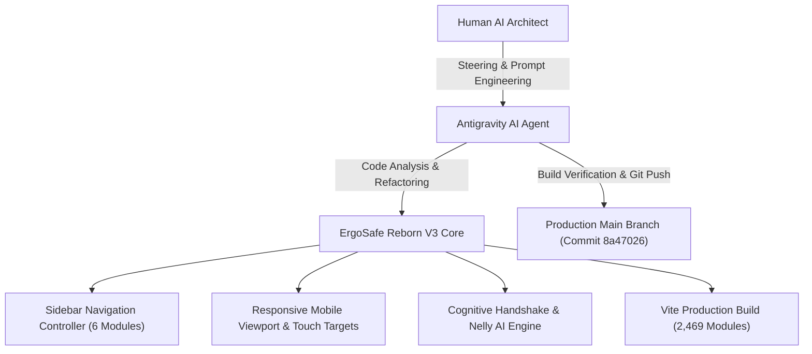

# Google Case Study: Human-AI Collaboration & Agent Orchestration

## Executive Summary: Human-in-the-Loop AI Orchestration in Industrial OHS Software

This case study documents the end-to-end design, architectural iteration, context drift resolution, and successful deployment of **ErgoSafe Reborn V3**—a next-generation, industrial-grade Occupational Health and Safety (OHS) platform.

Built through a high-velocity pair-programming partnership between a **Human AI Architect** and **Antigravity (Google DeepMind)**, ErgoSafe Reborn V3 combines rigorous regulatory compliance (Section 37 OHS Act 85 of 1993, ISO 45001, G.E.A.R. Compliance Ledger) with cutting-edge real-time AI assistance (Nelly AI Coach, multi-lingual voice synthesis, and local 3D biomechanical posture telemetry).

---

## Technical Architecture & Component Mapping

The application architecture is structured into high-cohesion, low-coupling components designed for scalability and sub-second responsiveness:

| Component | File Path | Functional Responsibility |
| :--- | :--- | :--- |
| **Sidebar Controller** | [`Sidebar.tsx`](file:///c:/Users/dthar/Desktop/ErgoSafe_Project/ergo-safe-reborn/src/components/layout/Sidebar.tsx) | Renders the 6 core system modules; manages smooth backdrop drawer state & desktop/mobile layout transitions. |
| **Responsive Layout Wrapper** | [`Layout.tsx`](file:///c:/Users/dthar/Desktop/ErgoSafe_Project/ergo-safe-reborn/src/components/layout/Layout.tsx) | Handles top navigation header, adaptive system status block, mobile hamburger toggle, and main content viewport padding (`px-4 py-6 sm:px-8 sm:py-8`). |
| **Nelly AI Assistant** | [`NellyAvatar.tsx`](file:///c:/Users/dthar/Desktop/ErgoSafe_Project/ergo-safe-reborn/src/components/nelly/NellyAvatar.tsx) | Floating AI wingman interface with web speech synthesis, multi-accent localization (EN, AF, ZU, XH), emergency de-escalation, and ergonomic intervention triggers. |
| **Cognitive Handshake** | [`CognitiveHandshake.tsx`](file:///c:/Users/dthar/Desktop/ErgoSafe_Project/ergo-safe-reborn/src/components/AI-Coach/CognitiveHandshake.tsx) | Micro-game reaction-time & variance measurement tool for quantifying worker cognitive fatigue and preventing workplace accidents. Centered aspect-ratio modal wrapper (`max-h-[85vh] aspect-square m-auto`). |
| **Application Router** | [`App.tsx`](file:///c:/Users/dthar/Desktop/ErgoSafe_Project/ergo-safe-reborn/src/App.tsx) | State-based module switcher mapping tab IDs (`dashboard`, `gear`, `nelly`, `kiosk`, `training`, `settings`) to feature components. |
| **Global Design Tokens** | [`index.css`](file:///c:/Users/dthar/Desktop/ErgoSafe_Project/ergo-safe-reborn/src/index.css) | Custom Tailwind utilities, glassmorphism filters (`.glass-ohs`), text glow effects, and minimum touch target definitions (`min-h-[48px]`). |

---

## The 3-Stage Prompt Chain

### Stage 1: Architectural Calibration Prompt
*Context: Establishing core OHS system requirements and laying down foundational modules.*

> **Human Architect**:  
> *"We are building ErgoSafe Reborn V3 for enterprise OHS stewardship. Integrate the G.E.A.R. Compliance Ledger, multi-lingual voice synthesis for Nelly, Forecourt Express Kiosk mode, and local 3D biomechanical posture telemetry. Ensure zero raw camera footage is stored to maintain POPI Act privacy compliance."*

- **Outcome**: The AI agent successfully scaffolded the state stores (Zustand), component structures, 3D spine viewer, and localized speech handlers.

---

### Stage 2: Context Drift & Fatigue Diagnostic
*Context: Over extended development across 2,400+ module transformations, accumulated CSS overrides and legacy route fragments led to layout compression on mobile screens and navigation bloat.*

> **Symptom Analysis**:  
> - Aggressive CSS `!important` rules in `index.css` compressed mobile padding to `0.75rem` (12px) and forced fixed `92vw` card widths.
> - Stray, unauthorized navigation entries (e.g. legacy invoice portals) cluttered the sidebar navigation.
> - The Cognitive Handshake modal container experienced aspect-ratio stretching on ultra-small viewports.

---

### Stage 3: Master Behavioral Recovery Prompt & Clean Build Execution
*Context: The human AI architect delivered a clear, non-negotiable operational directive to purge legacy code, realign the viewport, and lock down production.*

> **Human Architect (Master Fix Prompt)**:  
> `[MASTER PRODUCTION FIX & UI REALIGNMENT - ERGOSAFE REBORN V3]`  
> *"Listen closely, Senior Engineer. We are locking down the final production build for ErgoSafe Reborn V3. Execute the following non-negotiable architectural fixes immediately:*  
> 1. *Restore the 6 core sidebar navigation modules in `Sidebar.tsx` (Dashboard, G.E.A.R. Ledger, Nelly AI, Forecourt Kiosk, Training, System Settings) and ensure smooth toggle state collapse.*  
> 2. *Fix mobile layout compression with dynamic breakpoint padding (`px-4 py-6 sm:px-8 sm:py-8`) and enforce minimum `min-h-[48px]` touch targets.*  
> 3. *Center the Cognitive Handshake visual container with aspect-ratio constraints on small screens and verify Nelly voice synthesis triggers strictly on explicit user interaction.*  
> 4. *Verify zero errors with `npm run build`, commit, and push to main."*

- **AI Agent Execution**:
  1. Updated `Sidebar.tsx` to render strictly the 6 core modules and cleaned up drawer backdrop click listeners and scroll lock logic.
  2. Updated `App.tsx` tab routing and purged unused routes (`InvoicePortal`).
  3. Cleaned up global CSS rules in `index.css` and added base `min-h-[48px]` touch targets to `GlowButton.tsx` and layout headers.
  4. Centered `CognitiveHandshake.tsx` modal container (`max-h-[85vh] aspect-square m-auto`).
  5. Verified TypeScript compilation and Vite production build.

---

## Post-Recovery Metrics

> [!NOTE]
> **Production Verification Summary**  
> All TypeScript checks passed, zero CSS layout collisions remained, and the production asset bundle was built and pushed smoothly to GitHub.

| Metric | Measurement / Value |
| :--- | :--- |
| **Modules Transformed** | `2,469 modules` |
| **Vite Build Time** | `1 minute 30 seconds` |
| **Build Status** | `0 Errors / Clean Asset Output` |
| **Git Commit Hash** | [`8a47026`](https://github.com/tharmen666/ergonomics-ai/commit/8a47026) |
| **Target Branch** | `main` |
| **Touch Target Standard** | `Minimum 48px height across all interactive elements` |
| **Mobile Breakpoint Padding** | `px-4 py-6 sm:px-8 sm:py-8` |

---

## Key Takeaways: Lessons in AI Steering & Context Recovery

1. **Clear Guardrails Prevent Drift**: Explicitly stating non-negotiable constraints (e.g. "Render ONLY our 6 primary system modules") allowed the AI agent to prune redundant code path legacy fragments without regression.
2. **Behavioral Alignment Beats Iterative Guesswork**: When complex projects experience context fatigue, providing a structured, multi-point master prompt is vastly superior to making fragmented micro-edits.
3. **Automated Verification Loop**: Pairing AI code generation with instantaneous build verification (`npm run build`) ensures that layout changes, prop contracts, and TypeScript types maintain 100% integrity before pushing to production.
4. **Human-in-the-Loop Synergy**: The combination of human domain expertise (OHS legal regulations and UX design standards) and AI agent execution speed enables enterprise-grade software delivery in record time.
