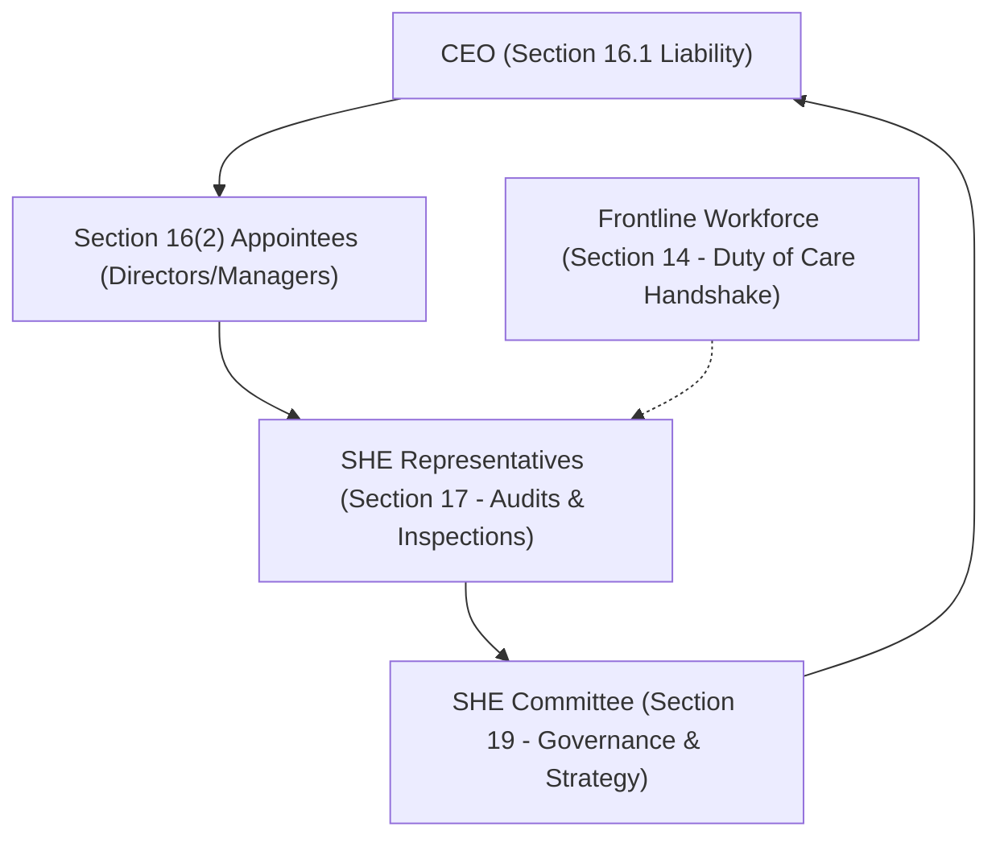
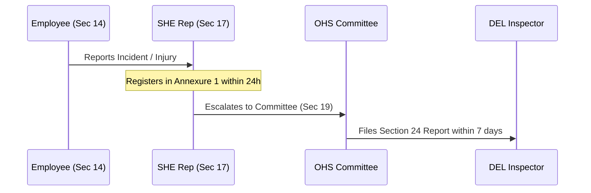
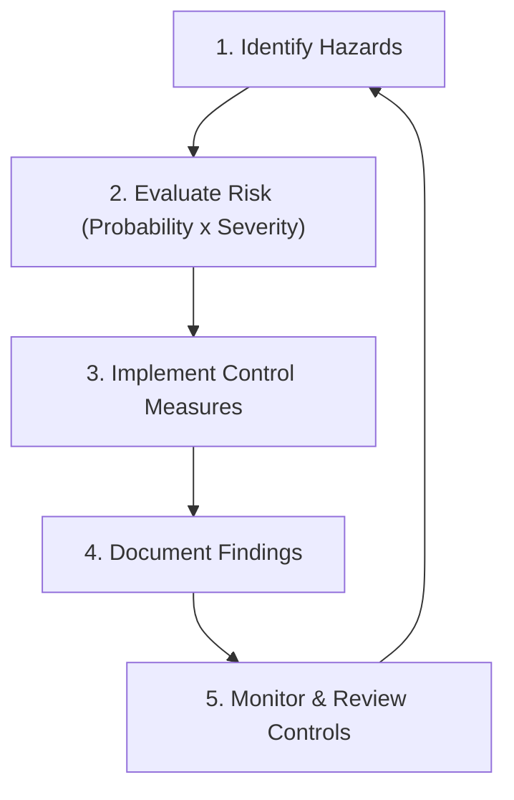

# OHS Haven: SHE Representative & Committee Training Manual
## Statutory Compliance Guide & Operations Manual (v2.5)
### Aligned to SAQA Unit Standard 259622 | NQF Level 2 | Credits: 4

---

> [!NOTE]
> This training manual is the official reference documentation for the **ErgoSafe Reborn: GEAR Pillars v2.5** safety ecosystem. It provides the statutory legal foundations, procedural inspection guidelines, and risk assessment schemas necessary to empower Health and Safety Representatives and Health and Safety Committees in the South African remote, hybrid, and physical work sectors.

---

## 📋 Course Registry & SAQA Matrix

| Parameter | Details |
| :--- | :--- |
| **Course Name** | Health and Safety Representative and Committee Training Course |
| **Statutory Base** | South African Occupational Health and Safety Act (Act 85 of 1993) |
| **Unit Standard Alignment** | **US 259622** - Describe the functions of the workplace health and safety representative |
| **NQF Level** | Level 2 |
| **Interactive Online Session** | 30 July 2026 (08:30 - 16:00) |
| **Registration Fee** | **R 2,240.00** per delegate (includes accredited material and certificates) |
| **Support Contact** | Deidre on (012) 666 8284 / 083 556 9407 |
| **Official Email** | [deidre@labourguide.co.za](mailto:deidre@labourguide.co.za) |

---



---

## 📘 MODULE 1: Introduction to Occupational Health and Safety in South Africa

### 1. The Legal Landscape
Occupational Health and Safety (OHS) in South Africa is governed primarily by the **Occupational Health and Safety Act, No. 85 of 1993 (OHS Act)**. The Act establishes a system of self-regulation and joint responsibility between employers and employees to ensure a workplace environment that is safe and without risk to health.

### 2. Primary Objectives of the OHS Act
*   **Protection**: To provide for the health and safety of persons at work.
*   **Safety of Public**: To protect persons other than those at work against hazards to health and safety arising out of or in connection with the activities of persons at work (e.g., contractors, visitors, members of the public).
*   **Advisory Council**: To establish an Advisory Council for Occupational Health and Safety.

### 3. Purpose & Benefits of SHE Representative Activities
Safety, Health, and Environmental (SHE) representation is not a mere "box-ticking" exercise; it is the cornerstone of proactive risk mitigation. The benefits include:
*   **Liability Minimization**: Documents "Reasonably Practicable" steps taken by the employer, shielding executives from Section 38 severe penalties.
*   **Reduction in Lost Time Injuries (LTIs)**: Proactively spots physical hazards (e.g., pooled water, faulty wiring) and ergonomic hazards (e.g., poor workstation setup leading to musculoskeletal strain).
*   **Culture of Care**: Transitions safety culture from reactive policing to collaborative, gamified stewardship.

---

## 📙 MODULE 2: Structural Layout of the OHS Act

The OHS Act consists of **50 Sections** and **22 sets of Regulations**. Understanding the structural layout is essential for locating statutory mandates.

```text
OHS Act (Act 85 of 1993)
├── Primary Sections (Section 1 to 50: Statutory Framework)
│   ├── Section 8: General Duties of Employers
│   ├── Section 14: General Duties of Employees
│   ├── Section 17/18: Health & Safety Representatives
│   └── Section 19/20: Health & Safety Committees
└── General Regulations (Statutory Prescriptions)
    ├── General Safety Regulations (GSR)
    ├── Environmental Regulations for Workplaces (ERW)
    ├── General Machinery Regulations (GMR)
    └── Facilities Regulations
```

### Core Statutory Definitions
*   **Reasonably Practicable**: Having regard to (a) the severity and scope of the hazard or risk concerned, (b) the state of knowledge reasonably available concerning that hazard or risk and of any means of removing or mitigating that hazard or risk, (c) the availability and suitability of means to remove or mitigate that hazard or risk, and (d) the cost of removing or mitigating that hazard or risk in relation to the benefits deriving therefrom.
*   **Hazard**: A source of or exposure to danger (something with the potential to cause harm).
*   **Risk**: The probability or likelihood that harm, injury, or damage will occur if exposure to a hazard is realized.
*   **Employee**: Any person who is employed by or works for an employer and who receives or is entitled to receive any remuneration or who works under the direction or supervision of an employer.

---

## 📕 MODULE 3: Legal Structures of the OHS Act

Health and safety is an structured, cascading responsibility routing from the boardroom directly to the work surface.


### Statutory Appointments & Responsibilities

#### 1. The Chief Executive Officer (Section 16.1)
The CEO is vested with strict, non-delegable statutory liability to ensure that the employer's duties under the Act are fully executed. The CEO bears ultimate responsibility for safety compliance and is the primary target of criminal prosecution under Section 38 in cases of corporate negligence.

#### 2. Section 16(2) Appointments
The CEO may delegate the execution of duties to designated managers (Section 16(2) appointees). However, this does not absolve the CEO of ultimate accountability. Section 16(2) managers must maintain continuous OHS compliance registries within their designated operational sectors.

#### 3. Health & Safety Representatives (Section 17)
*   **Mandate**: In every workplace with **more than 20 employees**, the employer **must** designate Health and Safety Representatives in writing.
*   **Ratio**:
    *   *Shops and Offices*: At least 1 Representative for every 100 employees.
    *   *Other Workplaces*: At least 1 Representative for every 50 employees.
*   **Term & Qualification**: Appointed for an agreed term, chosen from full-time employees who are acquainted with conditions and activities at that workplace.

#### 4. Health & Safety Committee (Section 19)
*   **Mandate**: Where **two or more** Health and Safety Representatives have been appointed, the employer **must** establish a Health and Safety Committee.
*   **Meeting Frequency**: The Committee must meet at least **once every three months** (quarterly), though high-hazard environments (like active construction or heavy logistics) should meet monthly.

---

## 📗 MODULE 4: Duties and Responsibilities of Stakeholders

### 1. General Duties of the Employer (Section 8)
Every employer must provide and maintain, as far as is reasonably practicable, a working environment that is safe and without risk to the health of their employees. This general duty includes:
*   Provision and maintenance of safe systems of work, plant, and machinery.
*   Taking steps to eliminate or mitigate hazards before resorting to Personal Protective Equipment (PPE).
*   Providing information, instruction, training, and supervision to ensure employee health and safety.
*   Enforcing safety measures in the workplace.

> [!WARNING]
> **Remote Work Jurisprudence**: Under 2026 administrative directives by the South African Department of Employment and Labour (DEL), **an employer's Section 8 Duty of Care extends fully to remote home offices**. Employers must actively verify and document that remote workstation setups are ergonomically sound and free from psychosocial hazards (like digital tethering).

### 2. General Duties of the Employee (Section 14)
Every employee must:
*   Take reasonable care for the health and safety of themselves and other persons who may be affected by their acts or omissions.
*   Cooperate with the employer to enable compliance with statutory requirements.
*   Carry out any lawful order given in the interest of health and safety.
*   Report any unsafe or unhealthy situation to the Health and Safety Representative or employer immediately.
*   Report any incident which may affect their health or cause injury before the end of the shift.

### 3. Duties of Contractors & Third Parties
Contractors working on an employer's premises are legally classified as "mandataries" under Section 37. The employer is held vicariously liable for the health and safety violations of contractors **unless** a written Section 37(2) Agreement is executed, formally transferring OHS compliance responsibilities to the contractor.

---

## 📘 MODULE 5: Health & Safety Representatives and Committees

### Functions of Health & Safety Representatives (Section 18)
A Health and Safety Representative has the statutory power to:
1.  **Review Effectiveness**: Review the effectiveness of health and safety measures.
2.  **Identify Hazards**: Identify potential hazards and potential major incidents at the workplace.
3.  **Examine Causes**: Examine the causes of incidents in collaboration with the employer.
4.  **Investigate Complaints**: Investigate complaints by employees relating to health and safety.
5.  **Represent Employees**: Make representations to the employer or a government inspector on general matters affecting health and safety at the workplace.
6.  **Conduct Inspections**: Inspect the workplace, including plant, machinery, and health and safety equipment.
7.  **Attend Committee Meetings**: Attend meetings of the Health and Safety Committee of which they are a member.

### Functions of Health & Safety Committees (Section 20)
*   Make recommendations to the employer regarding health and safety.
*   Discuss and resolve any health and safety incidents or hazards flagged by Representatives.
*   Keep detailed, timestamped minutes of all statutory committee proceedings, which must be retained for a minimum of **3 years** for auditing by DEL inspectors (ISO 9001 quality audit trail requirement).

---

## 📙 MODULE 6: Practical Health & Safety Prescriptions

Health and safety representatives must actively audit the following standard physical and operational parameters:

### 1. Health and Safety Policy (Section 7)
The employer must display a copy of the company's Health and Safety Policy, signed by the CEO, in a conspicuous place where employees can easily read it.

### 2. Copy of the OHS Act
Where there are **5 or more employees** in a workplace, the employer **must** make a copy of the OHS Act and the relevant regulations readily available to employees.

### 3. Incident Reporting & Recording (Section 24 / General Safety Regulation 9)
All workplace incidents resulting in death, unconsciousness, loss of limb, or an injury requiring medical treatment beyond first aid must be recorded in an official **Annexure 1 (Wcl 1/2) Incident Register** within 7 days, and reported directly to the Provincial Director of the DEL.



### 4. Incident Investigations (General Safety Regulation 9)
*   **Who**: The employer must designate an investigator (typically a SHE Representative) in writing.
*   **Timeline**: Investigation must commence within **7 days** of the incident.
*   **Output**: An official investigation report outlining the root causes and preventative control measures must be tabled at the next OHS Committee meeting.

### 5. Prohibited Deductions
Under Section 23, an employer **cannot** deduct money from an employee's salary or charge them for any safety equipment, training, or personal protective equipment (PPE) required to ensure their safety.

### 6. Duty Not to Interfere (Section 15)
No person shall intentionally or recklessly interfere with, damage, or misuse anything provided in the interest of health and safety (e.g., discharging a fire extinguisher in a non-emergency).

### 7. Housekeeping (Environmental Regulations for Workplaces)
All work areas, walkways, emergency exits, and electrical distribution boards must be kept clean, unobstructed, and free from loose cables or materials to prevent slips, trips, and falls.

### 8. Personal Protective Equipment (GSR 2)
*   **Hierarchy of Controls**: PPE is the **last line of defense**.
*   **Free of Charge**: Must be provided free of charge, fitted properly, and employees must be trained on its correct usage and storage.

### 9. Symbolic Safety Signs (SANS 1186)
Workplaces must display standardized symbolic safety signs (e.g., green for first aid/exit, red for firefighting, yellow for warnings, blue for mandatory instructions).

### 10. First Aid & First Aid Boxes (GSR 3)
*   **Ratio**: At least **1 First Aid Box** for every 100 employees in shops and offices, or 1 for every 50 in other workplaces.
*   **First Aider Ratio**: At least **1 trained First Aider** for every 50 employees (1:50).
*   **Content Checklist**: Must contain sterile dressings, antiseptic, bandages, scissors, splints, and biohazard gloves.

### 11. Stacking & Storing of Articles (GSR 8)
Materials must be stacked neatly and securely. Stacks must not obstruct fire extinguishers, escape routes, or light fixtures. The ratio of stack height to base width must not exceed **3:1** unless structurally secured.

### 12. Use of Ladders (GSR 13A)
Ladders must be inspected before use. They must be placed on a firm, level surface and angled at a **4:1 ratio** (1 meter out for every 4 meters up).

### 13. Flammable Liquids (GSR 4)
*   **Storage**: Hand sanitizers and other flammable solvents must be stored in specialized fireproof cabinets if quantities exceed **40 liters**.
*   **Safety distance**: Keep far away from ignition sources or hot machinery.

### 14. Use of Machinery (General Machinery Regulations)
Only fully trained, authorized personnel may operate machinery. Guard rails, safety screens, and emergency stop buttons must be functional and audited daily.

### 15. Sanitation & Facilities (Facilities Regulations)
Employers must provide clean, functional toilets, hand wash basins with running water, soap, and clean drying facilities. Ratios are typically **1 toilet per 15-20 employees** of each gender.

### 16. Hazardous Chemical Agents (HCA Regulations)
All HCAs must have a visible **Safety Data Sheet (SDS)**. Workers must be trained on the hazards, dilution instructions, and required PPE for handling each chemical.

### 17. Offences and Penalties (Section 38)
*   **Fine Thresholds**: Under the latest amendments, negligent executives face administrative fines up to **10% of company annual turnover or R5,000,000 (whichever is greater)**, or up to **2 years imprisonment**.
*   **DOA Lockouts**: Proactively restrict operational sign-offs on active high-fatigue readings, eliminating negligent liability.

---

## 📕 MODULE 7: Performing Health & Safety Activities

### 1. Participation in SHE Structures
Active involvement within workplace safety committees ensures continuous hazard recognition and keeps executive managers informed of frontline realities.

### 2. The Power of Teamwork
Safety is not an individual task. A robust safety culture relies on cross-departmental collaboration, uniting HR, Operations, Risk Management, and frontline workers under a unified compliance chain.

### 3. Consultation and Communication
SHE Representatives must maintain active channels of communication:
*   **Frontline workers**: Listening to daily safety complaints and feedback.
*   **OHS Committee**: Formally tabling hazards and requesting capital expenditure for control measures.
*   **Department of Employment & Labour**: Supporting external inspectors during unannounced regulatory audits.

### 4. Executing SHE Inspections
*   **Frequency**: Inspections must be conducted at least **once a month** by the designated Representative.
*   **Focus**: Systematically scan for structural issues, mechanical hazards, ergonomic hazards, PPE compliance, and emergency egress blocks.
*   **Recording**: Use standard OHS check sheets, noting all findings and corrective action deadlines in writing.

---

## 📘 MODULE 8: Performing Basic Risk Assessments

### 1. The Core Concept
A **Risk Assessment** is the systematic identification of workplace hazards, the evaluation of their associated risks, and the implementation of practical controls to protect workers.



### 2. The 5-Step Risk Assessment Method

#### Step 1: Identify the Hazards
Walk around the workplace and note anything with the potential to cause harm. Talk to workers, check previous incident records, and consult product safety data sheets.

#### Step 2: Decide Who Might Be Harmed and How
For each hazard, identify which groups of workers are at risk (e.g., office staff, warehouse operators, remote hybrid workers) and specify the type of injury or illness that could occur.

#### Step 3: Evaluate the Risk & Decide on Controls
Calculate the risk using the **Risk Matrix** ($Risk = Probability \times Severity$). Decide what actions are required to eliminate or control the hazard using the **Hierarchy of Controls**:

```text
Hierarchy of Controls (Most to Least Effective)
1. Elimination       (Physically remove the hazard)
2. Substitution      (Replace the hazard with a safer alternative)
3. Engineering       (Isolate people from the hazard, e.g., guards)
4. Administrative    (Change how people work, e.g., standard procedures)
5. PPE               (Protect the worker with equipment, e.g., safety glasses)
```

#### Step 4: Record Your Significant Findings
Document the identified hazards, control measures implemented, and designated responsible parties. This constitutes the legally admissible "Reasonably Practicable" audit trail.

#### Step 5: Review Your Assessment and Update
Review the assessment at least **once a year**, or immediately if there is a major incident, machine modification, or workspace reconfiguration.

---

## 📊 OHS Risk Assessment Calculation Matrix

To evaluate risk objectively, use the standard numerical formula:
$$\text{Risk Score (RS)} = \text{Probability (P)} \times \text{Severity (S)}$$

### 1. Evaluation Tables

| Probability (P) Rating | Definition | Severity (S) Rating | Definition |
| :---: | :--- | :---: | :--- |
| **5** | **Highly Likely** (Almost certain to occur) | **5** | **Catastrophic** (Fatality / Major structural collapse) |
| **4** | **Probable** (Likely to occur frequently) | **4** | **Major** (Lost time injury / Severe occupational disease) |
| **3** | **Possible** (May occur occasionally) | **3** | **Moderate** (Medical treatment case / Temporary illness) |
| **2** | **Unlikely** (Rare occurrence) | **2** | **Minor** (First aid case / Minor localized discomfort) |
| **1** | **Highly Unlikely** (Practically impossible) | **1** | **Negligible** (No injury / Negligible property damage) |

### 2. Action Levels Based on Risk Score

*   **RS 15 - 25**: 🔴 **HIGH RISK**: Halt operations immediately. Implement structural engineering controls before resuming.
*   **RS 8 - 12**: 🟡 **MEDIUM RISK**: Implement administrative controls, standard operating procedures (SOPs), and mandatory PPE.
*   **RS 1 - 6**: 🟢 **LOW RISK**: Acceptable risk. Monitor routinely to ensure controls remain effective.

---

## 📝 Statutory Training Verification Questionnaire
*For Course US 259622 NQF Level 2 Certification*

1.  **Under OHS Act Section 8, does an employer's duty of care apply to an employee working remotely from home?**
    *   *Answer*: Yes. Under Section 8 and the latest DEL administrative directives, the employer must ensure the remote workspace is safe and without risk, particularly regarding ergonomic safety.
2.  **What is the minimum ratio of Health and Safety Representatives required in an office environment with 250 employees?**
    *   *Answer*: 1 Representative for every 100 employees. Therefore, a minimum of 3 Representatives must be appointed.
3.  **Within how many days must a workplace incident be investigated, and how long must OHS Committee minutes be retained?**
    *   *Answer*: Investigations must commence within 7 days. OHS Committee minutes must be kept securely for a minimum of 3 years.
4.  **According to the Hierarchy of Controls, when should Personal Protective Equipment (PPE) be deployed?**
    *   *Answer*: Only as a last line of defense, after elimination, substitution, engineering, and administrative controls have been exhausted.
5.  **Explain the penalty liability faced by a CEO under OHS Act Section 38 for negligent safety failures.**
    *   *Answer*: The CEO faces an administrative fine up to 10% of annual company turnover or R5,000,000 (whichever is greater), or up to 2 years of imprisonment.

---
### *Safety, Health, and Environment: Driven by Ambition, Synchronized by GEAR.* 🐾
